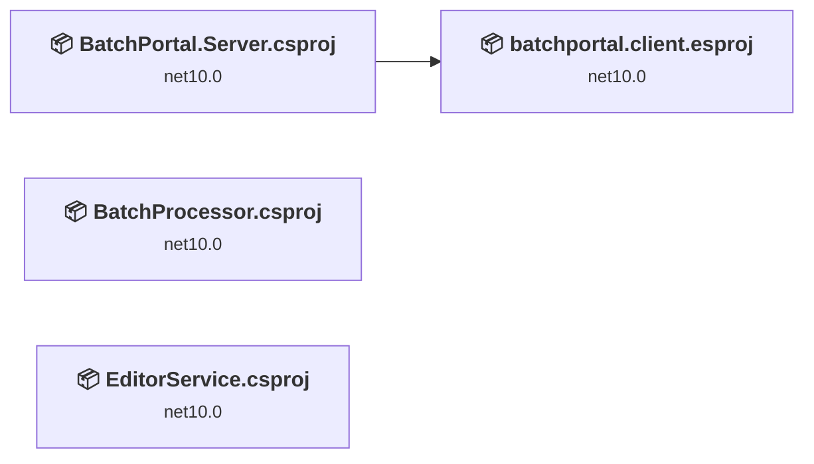
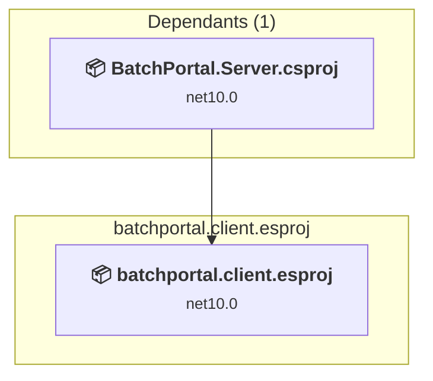
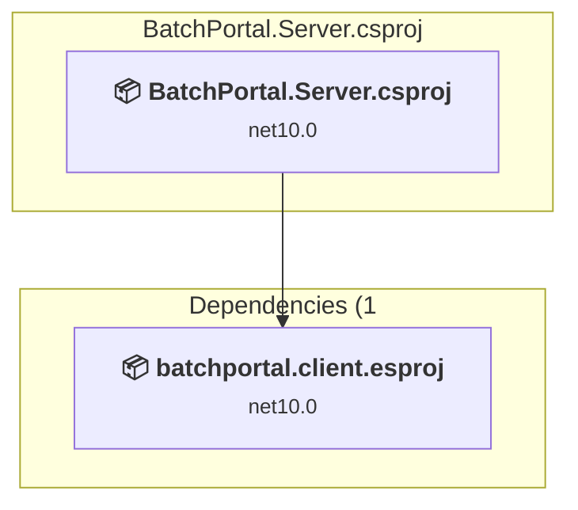
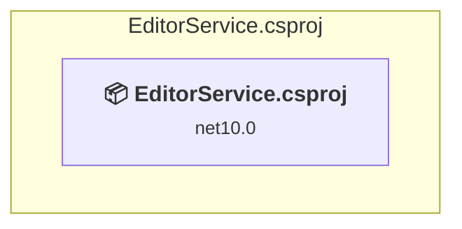

# Projects and dependencies analysis

This document provides a comprehensive overview of the projects and their dependencies in the context of upgrading to .NETCoreApp,Version=v10.0.

## Table of Contents

- [Executive Summary](#executive-Summary)
  - [Highlevel Metrics](#highlevel-metrics)
  - [Projects Compatibility](#projects-compatibility)
  - [Package Compatibility](#package-compatibility)
  - [API Compatibility](#api-compatibility)
  - [Binding Redirect Configuration](#binding-redirect-configuration)
- [Aggregate NuGet packages details](#aggregate-nuget-packages-details)
- [Top API Migration Challenges](#top-api-migration-challenges)
  - [Technologies and Features](#technologies-and-features)
  - [Most Frequent API Issues](#most-frequent-api-issues)
- [Projects Relationship Graph](#projects-relationship-graph)
- [Project Details](#project-details)

  - [BatchPortal\batchportal.client\batchportal.client.esproj](#batchportalbatchportalclientbatchportalclientesproj)
  - [BatchPortal\BatchPortal.Server\BatchPortal.Server.csproj](#batchportalbatchportalserverbatchportalservercsproj)
  - [BatchProcessor\BatchProcessor.csproj](#batchprocessorbatchprocessorcsproj)
  - [EditorService\EditorService.csproj](#editorserviceeditorservicecsproj)

## Executive Summary

### Highlevel Metrics

| Metric | Count | Status |
| :--- | :---: | :--- |
| Total Projects | 4 | 0 require upgrade |
| Total NuGet Packages | 7 | All compatible |
| Total Code Files | 10 |  |
| Total Code Files with Incidents | 0 |  |
| Total Lines of Code | 255 |  |
| Total Number of Issues | 0 |  |
| Estimated LOC to modify | 0+ | at least 0.0% of codebase |

### Projects Compatibility

| Project | Target Framework | Difficulty | Package Issues | API Issues | Binding Issues | Est. LOC Impact | Description |
| :--- | :---: | :---: | :---: | :---: | :---: | :---: | :--- |
| [BatchPortal\batchportal.client\batchportal.client.esproj](#batchportalbatchportalclientbatchportalclientesproj) | net10.0 | ✅ None | 0 | 0 | 0 |  | DotNetCoreApp, Sdk Style = True |
| [BatchPortal\BatchPortal.Server\BatchPortal.Server.csproj](#batchportalbatchportalserverbatchportalservercsproj) | net10.0 | ✅ None | 0 | 0 | 0 |  | AspNetCore, Sdk Style = True |
| [BatchProcessor\BatchProcessor.csproj](#batchprocessorbatchprocessorcsproj) | net10.0 | ✅ None | 0 | 0 | 0 |  | DotNetCoreApp, Sdk Style = True |
| [EditorService\EditorService.csproj](#editorserviceeditorservicecsproj) | net10.0 | ✅ None | 0 | 0 | 0 |  | DotNetCoreApp, Sdk Style = True |

### Package Compatibility

| Status | Count | Percentage |
| :--- | :---: | :---: |
| ✅ Compatible | 7 | 100.0% |
| ⚠️ Incompatible | 0 | 0.0% |
| 🔄 Upgrade Recommended | 0 | 0.0% |
| ***Total NuGet Packages*** | ***7*** | ***100%*** |

### API Compatibility

| Category | Count | Impact |
| :--- | :---: | :--- |
| 🔴 Binary Incompatible | 0 | High - Require code changes |
| 🟡 Source Incompatible | 0 | Medium - Needs re-compilation and potential conflicting API error fixing |
| 🔵 Behavioral change | 0 | Low - Behavioral changes that may require testing at runtime |
| ✅ Compatible | 0 |  |
| ***Total APIs Analyzed*** | ***0*** |  |

## Aggregate NuGet packages details

| Package | Current Version | Suggested Version | Projects | Description |
| :--- | :---: | :---: | :--- | :--- |
| Akka.Discovery.KubernetesApi | 1.5.70 |  | [BatchPortal.Server.csproj](#batchportalbatchportalserverbatchportalservercsproj) [BatchProcessor.csproj](#batchprocessorbatchprocessorcsproj) [EditorService.csproj](#editorserviceeditorservicecsproj) | ✅Compatible |
| Akka.Hosting | 1.5.70 |  | [BatchPortal.Server.csproj](#batchportalbatchportalserverbatchportalservercsproj) [BatchProcessor.csproj](#batchprocessorbatchprocessorcsproj) [EditorService.csproj](#editorserviceeditorservicecsproj) | ✅Compatible |
| Microsoft.AspNetCore.OpenApi | 10.0.11 |  | [BatchPortal.Server.csproj](#batchportalbatchportalserverbatchportalservercsproj) | ✅Compatible |
| Microsoft.AspNetCore.SpaProxy | 10.*-* |  | [BatchPortal.Server.csproj](#batchportalbatchportalserverbatchportalservercsproj) | ✅Compatible |
| Microsoft.Extensions.Hosting | 10.0.11 |  | [BatchProcessor.csproj](#batchprocessorbatchprocessorcsproj) [EditorService.csproj](#editorserviceeditorservicecsproj) | ✅Compatible |
| Petabridge.Cmd.Cluster | 1.5.0 |  | [BatchPortal.Server.csproj](#batchportalbatchportalserverbatchportalservercsproj) [BatchProcessor.csproj](#batchprocessorbatchprocessorcsproj) [EditorService.csproj](#editorserviceeditorservicecsproj) | ✅Compatible |
| Petabridge.Cmd.Host | 1.5.0 |  | [BatchPortal.Server.csproj](#batchportalbatchportalserverbatchportalservercsproj) [BatchProcessor.csproj](#batchprocessorbatchprocessorcsproj) [EditorService.csproj](#editorserviceeditorservicecsproj) | ✅Compatible |

## Top API Migration Challenges

### Technologies and Features

| Technology | Issues | Percentage | Migration Path |
| :--- | :---: | :---: | :--- |

### Most Frequent API Issues

| API | Count | Percentage | Category |
| :--- | :---: | :---: | :--- |

## Projects Relationship Graph

Legend:
📦 SDK-style project
⚙️ Classic project

## Project Details

### BatchPortal\batchportal.client\batchportal.client.esproj

#### Project Info

- **Current Target Framework:** net10.0✅
- **SDK-style**: True
- **Project Kind:** DotNetCoreApp
- **Dependencies**: 0
- **Dependants**: 1
- **Number of Files**: 0
- **Lines of Code**: 0
- **Estimated LOC to modify**: 0+ (at least 0.0% of the project)

#### Dependency Graph

Legend:
📦 SDK-style project
⚙️ Classic project

### API Compatibility

| Category | Count | Impact |
| :--- | :---: | :--- |
| 🔴 Binary Incompatible | 0 | High - Require code changes |
| 🟡 Source Incompatible | 0 | Medium - Needs re-compilation and potential conflicting API error fixing |
| 🔵 Behavioral change | 0 | Low - Behavioral changes that may require testing at runtime |
| ✅ Compatible | 0 |  |
| ***Total APIs Analyzed*** | ***0*** |  |

### BatchPortal\BatchPortal.Server\BatchPortal.Server.csproj

#### Project Info

- **Current Target Framework:** net10.0✅
- **SDK-style**: True
- **Project Kind:** AspNetCore
- **Dependencies**: 1
- **Dependants**: 0
- **Number of Files**: 8
- **Lines of Code**: 115
- **Estimated LOC to modify**: 0+ (at least 0.0% of the project)

#### Dependency Graph

Legend:
📦 SDK-style project
⚙️ Classic project

### API Compatibility

| Category | Count | Impact |
| :--- | :---: | :--- |
| 🔴 Binary Incompatible | 0 | High - Require code changes |
| 🟡 Source Incompatible | 0 | Medium - Needs re-compilation and potential conflicting API error fixing |
| 🔵 Behavioral change | 0 | Low - Behavioral changes that may require testing at runtime |
| ✅ Compatible | 0 |  |
| ***Total APIs Analyzed*** | ***0*** |  |

### BatchProcessor\BatchProcessor.csproj

#### Project Info

- **Current Target Framework:** net10.0✅
- **SDK-style**: True
- **Project Kind:** DotNetCoreApp
- **Dependencies**: 0
- **Dependants**: 0
- **Number of Files**: 7
- **Lines of Code**: 70
- **Estimated LOC to modify**: 0+ (at least 0.0% of the project)

#### Dependency Graph

Legend:
📦 SDK-style project
⚙️ Classic project

### API Compatibility

| Category | Count | Impact |
| :--- | :---: | :--- |
| 🔴 Binary Incompatible | 0 | High - Require code changes |
| 🟡 Source Incompatible | 0 | Medium - Needs re-compilation and potential conflicting API error fixing |
| 🔵 Behavioral change | 0 | Low - Behavioral changes that may require testing at runtime |
| ✅ Compatible | 0 |  |
| ***Total APIs Analyzed*** | ***0*** |  |

### EditorService\EditorService.csproj

#### Project Info

- **Current Target Framework:** net10.0✅
- **SDK-style**: True
- **Project Kind:** DotNetCoreApp
- **Dependencies**: 0
- **Dependants**: 0
- **Number of Files**: 7
- **Lines of Code**: 70
- **Estimated LOC to modify**: 0+ (at least 0.0% of the project)

#### Dependency Graph

Legend:
📦 SDK-style project
⚙️ Classic project

### API Compatibility

| Category | Count | Impact |
| :--- | :---: | :--- |
| 🔴 Binary Incompatible | 0 | High - Require code changes |
| 🟡 Source Incompatible | 0 | Medium - Needs re-compilation and potential conflicting API error fixing |
| 🔵 Behavioral change | 0 | Low - Behavioral changes that may require testing at runtime |
| ✅ Compatible | 0 |  |
| ***Total APIs Analyzed*** | ***0*** |  |

